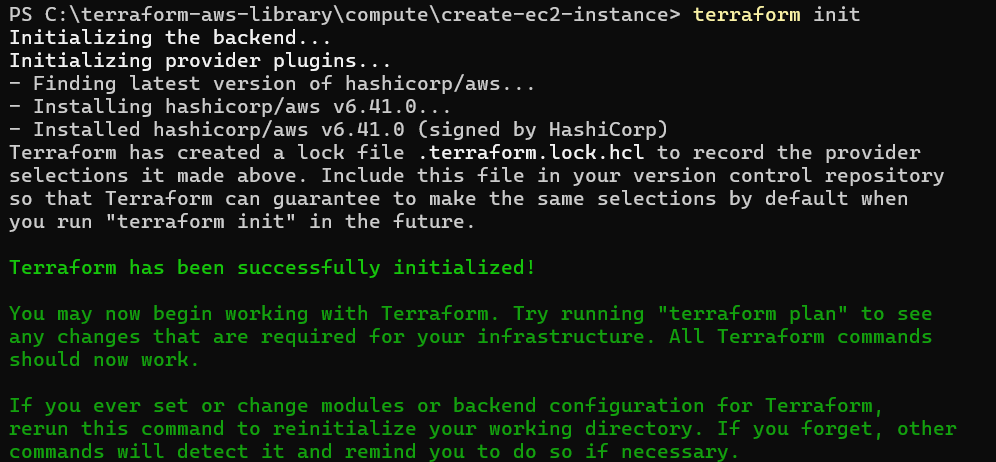
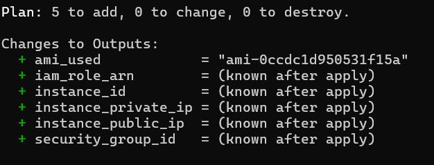
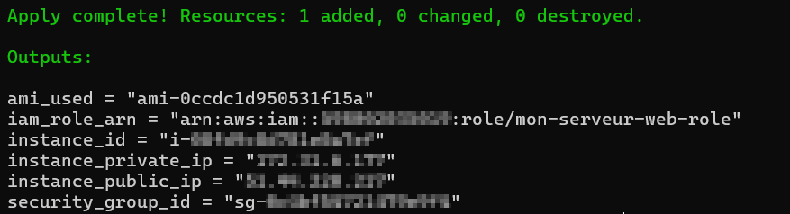
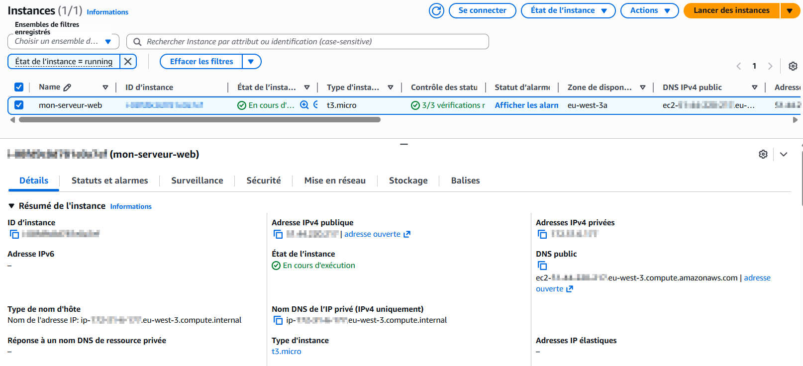
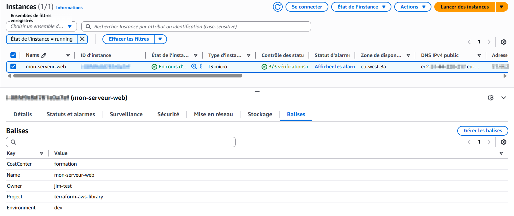
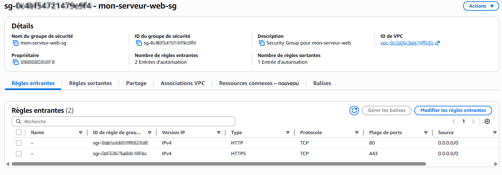
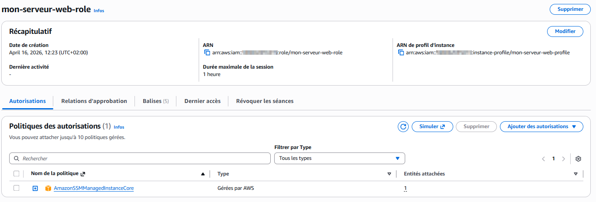
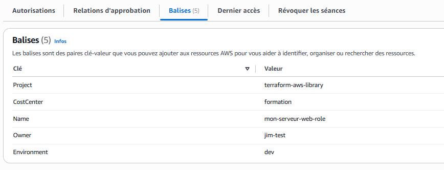

# 🖥️ Compute – Créer une instance EC2

## 📋 Description

Ce module Terraform crée une **instance EC2** sur AWS avec toutes les ressources associées :
Security Group, rôle IAM, Instance Profile et script de démarrage (User Data).

> 💡 **C'est quoi une instance EC2 ?** C'est un serveur virtuel dans le cloud AWS. Tu choisis son OS, sa puissance, et il est opérationnel en quelques secondes.

L'accès se fait via **AWS Systems Manager (SSM)** — le port SSH (22) est fermé par défaut pour limiter la surface d'attaque.

> 🔐 **Pourquoi pas SSH ?** Le port 22 est constamment scanné par des bots sur internet. SSM permet de se connecter de façon sécurisée sans ouvrir aucun port, en passant par l'API AWS.

## 📁 Structure du module

```
create-ec2-instance/
├── main.tf           # Définit les ressources AWS à créer (EC2, SG, IAM)
├── variables.tf      # Déclare les paramètres configurables
├── outputs.tf        # Retourne les informations après déploiement
├── terraform.tfvars  # À créer toi-même — non inclus dans le repo (voir Configuration)
└── assets/           # Screenshots de démonstration
```

## 🛠️ Prérequis

- Compte AWS actif
- AWS CLI installé et configuré (`aws configure`)
- Terraform installé (v1.0+)
- Un VPC et un subnet existants

> 💡 **Pas de VPC ?** Pas de panique. Chaque compte AWS possède un **VPC par défaut** prêt à l'emploi. Va dans la console AWS → VPC → Your VPCs pour récupérer son ID.

## 📥 Installation

```bash
git clone https://github.com/Jimmy-Barbier/terraform-aws-library.git
cd terraform-aws-library/compute/create-ec2-instance
```

## ⚙️ Configuration

Crée un fichier `terraform.tfvars` dans le dossier `create-ec2-instance` avec tes valeurs :

```hcl
instance_name    = "mon-serveur-web"
instance_type    = "t3.micro"
ami_id           = ""
root_volume_size = 20

vpc_id    = "vpc-xxxxxxxxxxxxxxxxx"
subnet_id = "subnet-xxxxxxxxxxxxxxxxx"

allowed_ports       = [80, 443]
allowed_cidr_blocks = ["0.0.0.0/0"]

user_data = ""

tags = {
  Project     = "terraform-aws-library"
  Environment = "dev"
  Owner       = "ton-nom"
  CostCenter  = "formation"
}
```

> ⚠️ **Free Tier** : En région `eu-west-3` (Paris), utilise `t3.micro` et non `t2.micro` qui n'est plus éligible au Free Tier.

> 💡 **Comment trouver mon vpc_id et subnet_id ?**
> - Console AWS → VPC → Your VPCs → copie l'ID du VPC par défaut
> - Console AWS → VPC → Subnets → copie l'ID d'un subnet de ce VPC

## 🚀 Déploiement

```bash
# 1. Initialiser Terraform (télécharge le provider AWS)
terraform init

# 2. Vérifier ce qui va être créé SANS rien créer
terraform plan

# 3. Créer les ressources sur AWS
terraform apply
```

## ✅ Résultat

### terraform init


### terraform plan


### terraform apply


### Instance EC2 dans la console AWS


### Tags de l'instance


### Security Group — ports 80 et 443 ouverts, SSH fermé


### Rôle IAM avec politique SSM


### Tags du rôle IAM


## 🗑️ Nettoyage

```bash
terraform destroy
```

⚠️ Cette commande supprime **toutes** les ressources créées par ce module.
À utiliser avec précaution en production.

## 📝 Notes

- Le port **SSH (22) est fermé** par défaut — accès via **AWS Systems Manager** uniquement
- Le volume racine est **chiffré** par défaut (`encrypted = true`, type `gp3`)
- L'AMI est **auto-détectée** : si `ami_id` est laissé vide, Terraform récupère automatiquement la dernière Amazon Linux 2023 disponible dans ta région
- Les tags `Project`, `Environment`, `Owner` et `CostCenter` sont **obligatoires** — Terraform refusera de continuer s'ils sont absents
- En région Paris (`eu-west-3`), utilise `t3.micro` au lieu de `t2.micro` pour rester dans le Free Tier

## 📊 Variables

| Nom | Description | Type | Obligatoire |
|-----|-------------|------|-------------|
| `instance_name` | Nom de l'instance et des ressources associées | string | ✅ |
| `instance_type` | Type d'instance EC2 | string | ❌ |
| `ami_id` | ID de l'AMI (vide = Amazon Linux 2023 auto) | string | ❌ |
| `root_volume_size` | Taille du volume racine en Go | number | ❌ |
| `vpc_id` | ID du VPC cible | string | ✅ |
| `subnet_id` | ID du subnet cible | string | ✅ |
| `allowed_ports` | Ports entrants ouverts dans le Security Group | list(number) | ❌ |
| `allowed_cidr_blocks` | CIDR autorisés pour le Security Group | list(string) | ❌ |
| `user_data` | Script de démarrage personnalisé | string | ❌ |
| `tags` | Tags (Project, Environment, Owner, CostCenter obligatoires) | map(string) | ✅ |

## 📤 Outputs

| Nom | Description |
|-----|-------------|
| `instance_id` | ID de l'instance EC2 |
| `instance_public_ip` | Adresse IP publique |
| `instance_private_ip` | Adresse IP privée |
| `security_group_id` | ID du Security Group |
| `iam_role_arn` | ARN du rôle IAM |
| `ami_used` | ID de l'AMI utilisée |

## 🔗 Modules liés

- [`iam/create-user`](../../iam/create-user/) — Création d'un utilisateur IAM
- [`storage/create-bucket`](../../storage/create-bucket/) — Création d'un bucket S3
