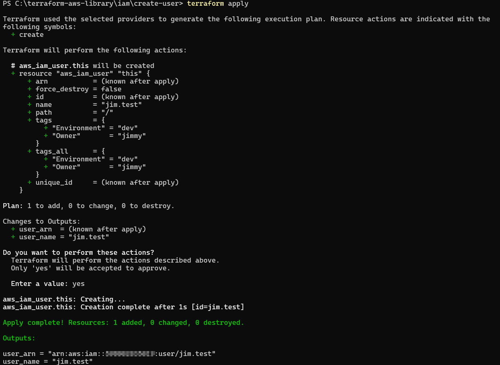
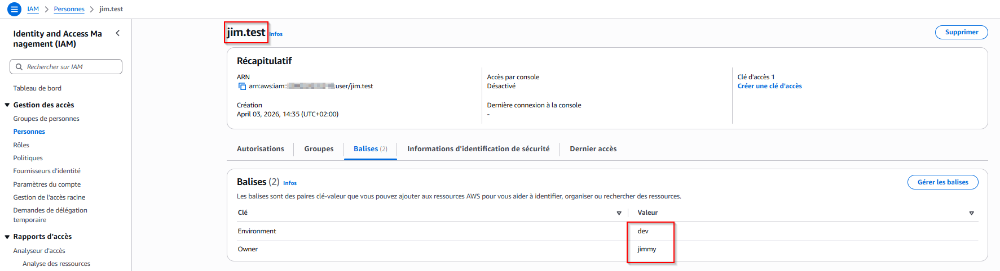

# 👤 IAM – Créer un utilisateur

## 📋 Description
Ce module Terraform crée un utilisateur IAM sur AWS avec des tags configurables.
L'utilisateur est créé sans accès console — voir la section Notes pour plus d'informations.

## 📁 Structure du module
```
create-user/
├── main.tf          # Définit la ressource IAM user à créer sur AWS
├── variables.tf     # Déclare les paramètres configurables (nom, tags)
├── outputs.tf       # Retourne les informations après déploiement (nom, ARN)
├── terraform.tfvars # Tes valeurs personnelles — à créer toi-même (non inclus)
└── assets/          # Screenshots de démonstration
```

## 🛠️ Prérequis
- Compte AWS actif
- AWS CLI installé et configuré (`aws configure`)
- Terraform installé (v1.0+)

## 📥 Installation
```bash
git clone https://github.com/Jimmy-Barbier/terraform-aws-library.git
cd terraform-aws-library/iam/create-user
```

## ⚙️ Configuration
Crée un fichier `terraform.tfvars` dans le dossier `create-user` :
```hcl
user_name = "prenom.nom"
tags = {
  Environment = "dev"
  Owner       = "ton-nom"
}
```

## 🚀 Déploiement
```bash
# 1. Initialiser Terraform
terraform init

# 2. Vérifier ce qui va être créé
terraform plan

# 3. Créer l'utilisateur
terraform apply
```

## ✅ Résultat

### terraform apply


### Vérification dans la console AWS


## 🗑️ Nettoyage
```bash
terraform destroy
```
⚠️ Cette commande supprime toutes les ressources créées par ce module.
À utiliser avec précaution en production.

## 📝 Notes
- L'utilisateur est créé **sans accès console** par défaut
- Pour activer l'accès console deux options :

**Option 1 — Manuellement**
IAM → Users → Security credentials → Enable console access
L'admin définit un mot de passe temporaire et force le changement à la première connexion.

**Option 2 — AWS IAM Identity Center (bonne pratique entreprise)**
L'utilisateur reçoit un email automatique pour définir son mot de passe.
Recommandé pour les environnements multi-utilisateurs.

## 📊 Variables
| Nom | Description | Type | Obligatoire |
|-----|-------------|------|-------------|
| user_name | Nom de l'utilisateur IAM | string | ✅ |
| tags | Tags à appliquer | map(string) | ❌ |

## 📤 Outputs
| Nom | Description |
|-----|-------------|
| user_name | Nom de l'utilisateur créé |
| user_arn | ARN de l'utilisateur créé |
