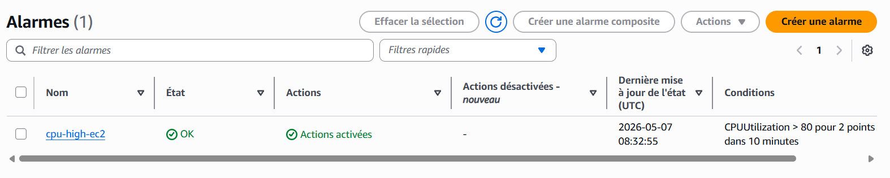
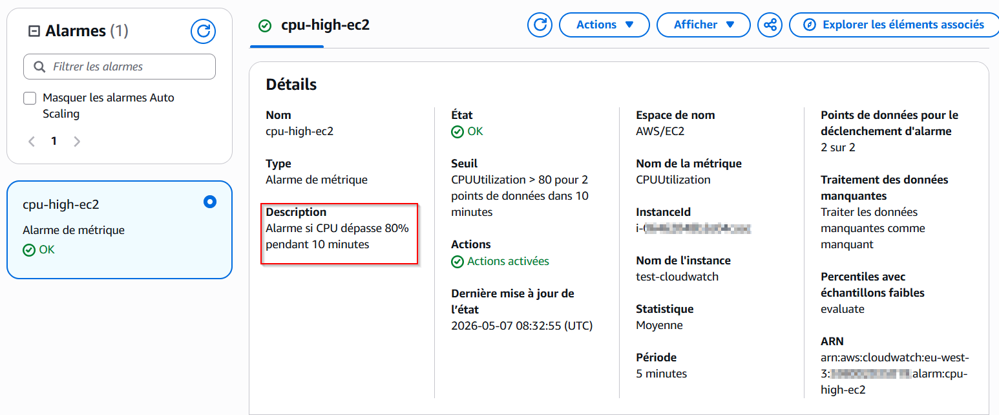
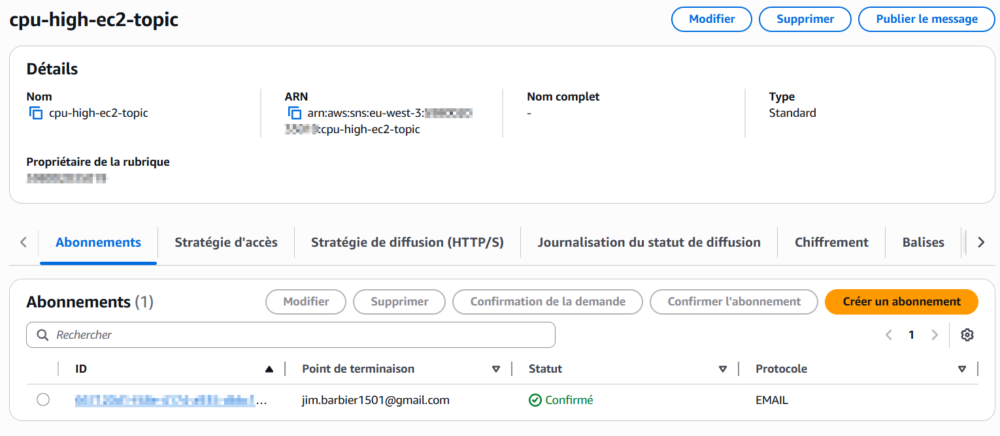
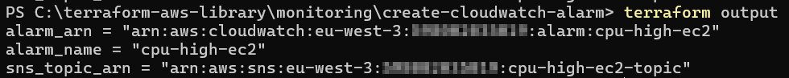

# 📊 Monitoring – Créer une alarme CloudWatch

## 📋 Description

Ce module Terraform crée une **alarme CloudWatch** sur AWS avec notification email via SNS.
L'alarme surveille une métrique AWS (ex: CPU d'une EC2) et envoie une alerte quand le seuil défini est dépassé.

## 📁 Structure du module

```
create-cloudwatch-alarm/
├── main.tf          # Définit l'alarme CloudWatch et le topic SNS
├── variables.tf     # Déclare les paramètres configurables
├── outputs.tf       # Retourne les informations après déploiement
├── terraform.tfvars # Tes valeurs personnelles — à créer toi-même (non inclus)
└── assets/          # Screenshots de démonstration
```

## 🛠️ Prérequis

- Compte AWS actif
- AWS CLI installé et configuré (`aws configure`)
- Terraform installé (v1.0+)

## 📥 Installation

```bash
git clone https://github.com/Jimmy-Barbier/terraform-aws-library.git
cd terraform-aws-library/monitoring/create-cloudwatch-alarm
```

## ⚙️ Configuration

Crée un fichier `terraform.tfvars` dans le dossier `create-cloudwatch-alarm` :

```hcl
alarm_name          = "cpu-high-ec2"
alarm_description   = "Alarme si CPU dépasse 80% pendant 10 minutes"
metric_name         = "CPUUtilization"
namespace           = "AWS/EC2"
threshold           = 80
alert_email         = "ton-email@exemple.com"

comparison_operator = "GreaterThanThreshold"
evaluation_periods  = 2
period              = 300
statistic           = "Average"
treat_missing_data  = "missing"

dimensions = {
  InstanceId = "i-xxxxxxxxxxxxxxxxx"
}

tags = {
  Project     = "terraform-aws-library"
  Module      = "create-cloudwatch-alarm"
  Environment = "dev"
  ManagedBy   = "terraform"
}
```

> ⚠️ Ne commite jamais ton fichier `terraform.tfvars` — il contient ton email. Il est exclu par le `.gitignore`.

## 🚀 Déploiement

```bash
# 1. Initialiser Terraform
terraform init

# 2. Vérifier ce qui va être créé
terraform plan

# 3. Déployer
terraform apply
```

> 📧 Après le `apply`, AWS envoie un email de confirmation à l'adresse fournie. Tu dois cliquer sur le lien pour activer la subscription SNS.

## ✅ Résultat

### Alarme CloudWatch dans la console AWS


### Détail de l'alarme


### Topic SNS avec subscription confirmée


### Outputs Terraform


## 🗑️ Nettoyage

```bash
terraform destroy
```

⚠️ Cette commande supprime l'alarme CloudWatch et le topic SNS.
À utiliser avec précaution en production.

## 📝 Notes

- L'alarme surveille la métrique `CPUUtilization` du namespace `AWS/EC2` par défaut
- Le paramètre `dimensions` permet de cibler une instance EC2 précise via son `InstanceId`
- Sans `dimensions`, l'alarme surveille la métrique de façon globale sur tout le namespace
- `evaluation_periods = 2` et `period = 300` signifie que l'alarme se déclenche après **10 minutes** consécutives au-dessus du seuil
- `ok_actions` est configuré : tu reçois aussi un email quand la situation revient à la normale

## 📊 Variables

| Nom | Description | Type | Défaut | Obligatoire |
|-----|-------------|------|--------|-------------|
| alarm_name | Nom de l'alarme | string | — | ✅ |
| alarm_description | Description de l'alarme | string | `""` | ❌ |
| metric_name | Métrique surveillée (ex: CPUUtilization) | string | — | ✅ |
| namespace | Namespace AWS (ex: AWS/EC2) | string | — | ✅ |
| threshold | Valeur seuil de déclenchement | number | — | ✅ |
| alert_email | Email de notification | string | — | ✅ |
| comparison_operator | Opérateur de comparaison | string | `GreaterThanThreshold` | ❌ |
| evaluation_periods | Nombre de périodes consécutives | number | `2` | ❌ |
| period | Durée d'une période en secondes | number | `300` | ❌ |
| statistic | Statistique utilisée | string | `Average` | ❌ |
| treat_missing_data | Comportement si données manquantes | string | `missing` | ❌ |
| dimensions | Ressource ciblée (ex: InstanceId) | map(string) | `{}` | ❌ |
| tags | Tags appliqués aux ressources | map(string) | `{}` | ❌ |

## 📤 Outputs

| Nom | Description |
|-----|-------------|
| alarm_arn | ARN de l'alarme CloudWatch |
| alarm_name | Nom de l'alarme |
| sns_topic_arn | ARN du topic SNS |
