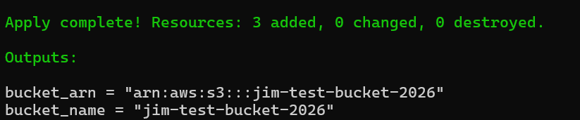
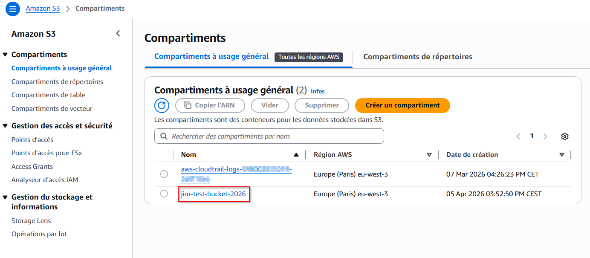
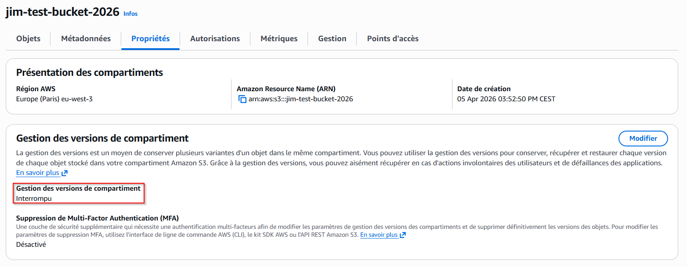
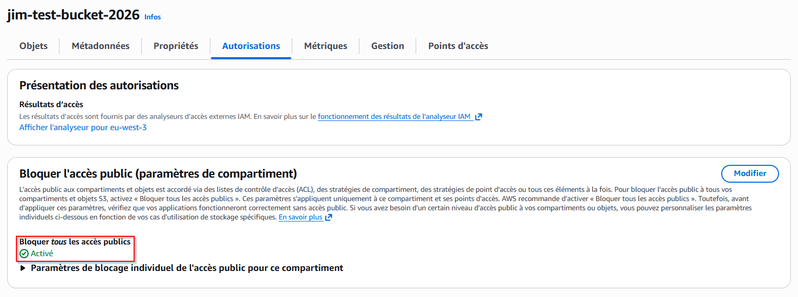
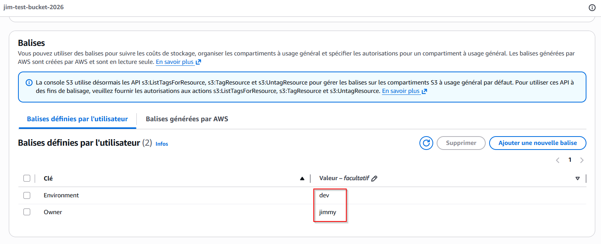

# 🗄️ S3 – Créer un bucket

## 📋 Description
Ce module Terraform crée un bucket S3 sur AWS avec versioning et blocage d'accès public configurables.

## 📁 Structure du module

create-bucket/
├── main.tf          # Définit les ressources S3 à créer sur AWS
├── variables.tf     # Déclare les paramètres configurables
├── outputs.tf       # Retourne les informations après déploiement
├── terraform.tfvars # Tes valeurs personnelles — à créer toi-même (non inclus)
└── assets/          # Screenshots de démonstration

## 🛠️ Prérequis
- Compte AWS actif
- AWS CLI installé et configuré (`aws configure`)
- Terraform installé (v1.0+)

## 📥 Installation
```bash
git clone https://github.com/Jimmy-Barbier/terraform-aws-library.git
cd terraform-aws-library/storage/create-bucket
```

## ⚙️ Configuration
Crée un fichier `terraform.tfvars` dans le dossier `create-bucket` :
```hcl
bucket_name         = "ton-bucket-name"
versioning          = false
block_public_access = true
tags = {
  Environment = "dev"
  Owner       = "ton-nom"
}
```

## 🚀 Déploiement
```bash
# 1. Initialiser Terraform
terraform init

# 2. Vérifier ce qui va être créé
terraform plan

# 3. Créer le bucket
terraform apply
```

## ✅ Résultat

### terraform apply


### Console AWS – Liste des buckets


### Console AWS – Versioning


### Console AWS – Block Public Access


### Console AWS – Tags


## 🗑️ Nettoyage
```bash
terraform destroy
```
⚠️ Cette commande supprime toutes les ressources créées par ce module.
À utiliser avec précaution en production.

## 📊 Variables
| Nom | Description | Type | Défaut | Obligatoire |
|-----|-------------|------|--------|-------------|
| bucket_name | Nom du bucket S3 | string | - | ✅ |
| versioning | Activer le versioning | bool | false | ❌ |
| block_public_access | Bloquer l'accès public | bool | true | ❌ |
| tags | Tags à appliquer | map(string) | {} | ❌ |

## 📤 Outputs
| Nom | Description |
|-----|-------------|
| bucket_name | Nom du bucket créé |
| bucket_arn | ARN du bucket créé |
