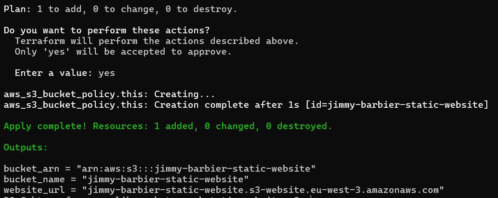
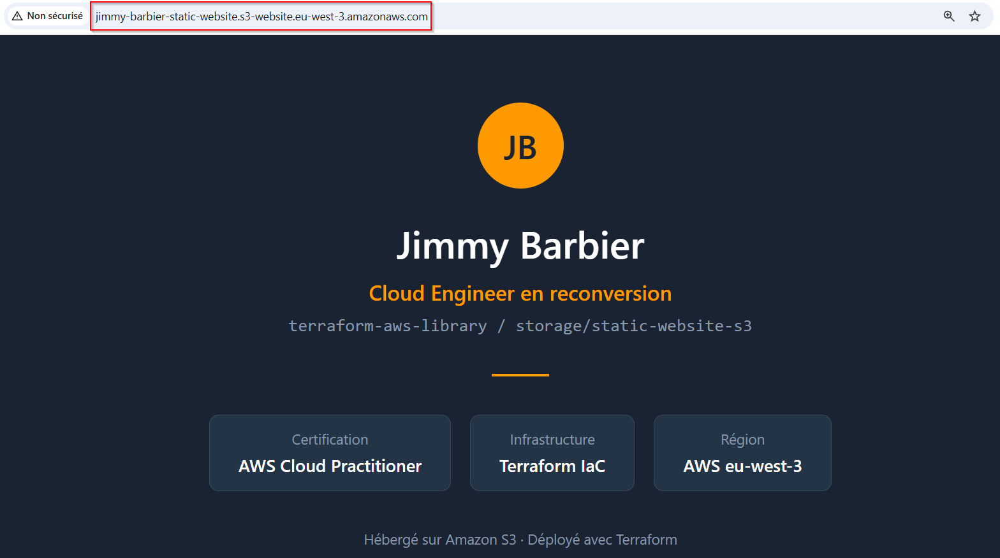
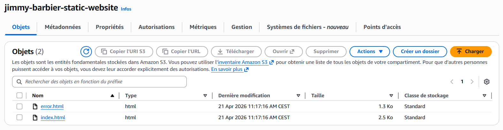

# 🌐 Storage – Site statique sur S3

## 📋 Description

Ce module Terraform crée un **site web statique** hébergé sur Amazon S3, avec upload automatique des fichiers HTML et accès public configuré.

> 💡 **C'est quoi un site statique ?** C'est un site composé uniquement de fichiers HTML/CSS/JS — pas de serveur, pas de base de données. Amazon S3 peut héberger ce type de site directement depuis un bucket.

> ⚠️ **HTTP uniquement** : S3 static website hosting ne supporte pas HTTPS nativement. Pour activer HTTPS, il faudrait ajouter CloudFront devant le bucket — c'est un module à part entière.

## 📁 Structure du module

```
static-website-s3/
├── main.tf           # Définit les ressources AWS à créer (bucket, config, politique)
├── variables.tf      # Déclare les paramètres configurables
├── outputs.tf        # Retourne les informations après déploiement
├── terraform.tfvars  # À créer toi-même — non inclus dans le repo (voir Configuration)
├── website/
│   ├── index.html    # Page principale du site
│   └── error.html    # Page 404
└── assets/           # Screenshots de démonstration
```

## 🛠️ Prérequis

- Compte AWS actif
- AWS CLI installé et configuré (`aws configure`)
- Terraform installé (v1.0+)

## 📥 Installation

```bash
git clone https://github.com/Jimmy-Barbier/terraform-aws-library.git
cd terraform-aws-library/storage/static-website-s3
```

## ⚙️ Configuration

Crée un fichier `terraform.tfvars` dans le dossier `static-website-s3` :

```hcl
bucket_name    = "ton-nom-static-website"
index_document = "index.html"
error_document = "error.html"

tags = {
  Project     = "terraform-aws-library"
  Environment = "dev"
  Owner       = "ton-nom"
  CostCenter  = "formation"
}
```

> ⚠️ **Nom unique** : Le nom du bucket S3 doit être **unique mondialement** sur AWS. Si le nom est déjà pris, Terraform retournera une erreur — change le nom et relance.

## 🚀 Déploiement

```bash
# 1. Initialiser Terraform (télécharge le provider AWS)
terraform init

# 2. Vérifier ce qui va être créé SANS rien créer
terraform plan

# 3. Créer les ressources et déployer le site
terraform apply
```

## ✅ Résultat

### terraform apply


### Site live dans le navigateur


### Console AWS — fichiers uploadés


## 🗑️ Nettoyage

```bash
terraform destroy
```

⚠️ Cette commande supprime **toutes** les ressources créées par ce module.
À utiliser avec précaution en production.

## 📝 Notes

- Les fichiers `index.html` et `error.html` sont **uploadés automatiquement** dans le bucket lors du `terraform apply`
- Si tu modifies le HTML, un `terraform apply` suffit pour re-déployer — Terraform détecte les changements via le `etag`
- Le bucket est configuré en **accès public** — c'est voulu pour un site web. Ne jamais faire ça pour du stockage de données sensibles
- Les tags `Project`, `Environment`, `Owner` et `CostCenter` sont **obligatoires** — Terraform refusera de continuer s'ils sont absents
- Pour activer **HTTPS**, il faut ajouter CloudFront devant le bucket (`network/cloudfront-s3` — à venir)

## 📊 Variables

| Nom | Description | Type | Obligatoire |
|-----|-------------|------|-------------|
| `bucket_name` | Nom du bucket S3 (unique mondialement) | string | ✅ |
| `index_document` | Fichier HTML de la page principale | string | ❌ (défaut index.html) |
| `error_document` | Fichier HTML de la page d'erreur 404 | string | ❌ (défaut error.html) |
| `tags` | Tags (Project, Environment, Owner, CostCenter obligatoires) | map(string) | ✅ |

## 📤 Outputs

| Nom | Description |
|-----|-------------|
| `bucket_name` | Nom du bucket S3 |
| `bucket_arn` | ARN du bucket S3 |
| `website_url` | URL publique du site statique |

## 🔗 Modules liés

- [`iam/create-user`](../../iam/create-user/) — Création d'un utilisateur IAM
- [`storage/create-bucket`](../../storage/create-bucket/) — Création d'un bucket S3
- [`compute/create-ec2-instance`](../../compute/create-ec2-instance/) — Création d'une instance EC2